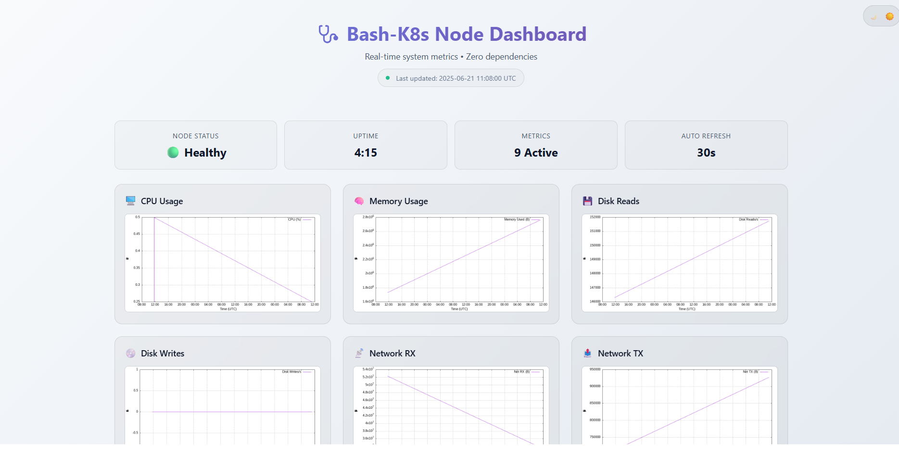

# 🩺 Bash-K8s-Monitor

**A 12 MB Bash + gnuplot DaemonSet that turns every Amazon EKS node into a self-served health dashboard.**

*No Prometheus. No Grafana. No lock-in. Just the shell that ships with every Linux box.*

[](../../actions)
[](LICENSE)

[**☕ Buy me a coffee**](https://coff.ee/heinanca)



*Modern, responsive dashboard with real-time metrics visualization*

---

## ✨ Features

- **Portable** – tiny Alpine image (≈ 12 MB) runs anywhere EKS does, even Fargate
- **Self-contained** – scrapes `/proc`, stores metrics in `metrics.db`, renders graphs with `gnuplot`
- **Zero cloud egress** – metrics stay on-node unless you choose to ship them (CloudWatch side-car included)
- **One-liner deployment** – `./build_push.sh && kubectl apply -f k8s/`
- **Hackable** – pure Bash; add or remove metrics by editing a function

---

## 🔍 Architecture

```
┌──────────────────────┐  DaemonSet  ┌─────────────────────────┐
│  Each EKS node       │◀───────────▶│  bash-collector:latest  │
└──────────────────────┘             └──────────┬──────────────┘
                                                 │
                                        metrics.db
                                                 ▲
                                      gnuplot ⇒ PNGs every 30s
                                                 ▼
                                 dashboard/{*.png,index.html}
                                                 │
                       ClusterIP Service  ◀─────┘  (Ingress/NLB optional)
```

---

## 🚀 Quick Start

```bash
# 1) Clone
git clone https://github.com/HeinanCA/bash-k8s-monitor.git
cd bash-k8s-monitor

# 2) Build, push to ECR, patch manifest
chmod +x build_push.sh
./build_push.sh -r us-east-1     # -r to override default AWS region

# 3) Deploy
kubectl apply -f k8s/daemonset.yaml
kubectl rollout status daemonset/bash-monitor

# 4) View dashboard
kubectl apply -f k8s/service.yaml          # Cluster-internal Service
kubectl port-forward svc/bash-monitor 8080:80
open http://localhost:8080
```

**Need retention?** `kubectl apply -f extras/cloudwatch-sidecar.yaml` ships the CSV to CloudWatch Logs.

---

## ⚙️ Configuration

| Variable (in **config.env**) | Default | Meaning |
|------------------------------|---------|---------|
| SCRAPE_INTERVAL | 15 | seconds between metric scrapes |
| RENDER_INTERVAL | 30 | seconds between PNG refreshes |
| CSV_PATH | /data/metrics.db | path inside container |
| DASH_PATH | /data/dashboard | where PNG + HTML are produced |
| ENABLED_METRICS | cpu,mem,disk,net,load | comma list – comment out any you don't need |
| MAX_LINES | 10000 | rotate CSV after this many rows |
| MAX_ROTATED_FILES | 5 | how many backups to keep |

---

## 🤝 Contributing

1. Fork → hack → PR
2. Follow Conventional Commits for messages (`feat:`, `fix:`, etc.)
3. Run `shellcheck **/*.sh` and `shfmt -d -i 2 -ci` before committing
4. New features must include docs + a demo-ready GIF under `/docs`
5. PR description checklist:
   - Tested on EKS ≥ v1.28
   - `kubectl logs` clean
   - No secrets in code/manifest

We use GitHub Actions (`main.yml`) to lint and build every PR. Green checks make maintainers happy.

Not ready for code yet? → open an issue, propose an idea, or improve docs.

---

## 📅 Roadmap

- Dark-mode CSS toggle (DONE!)
- Pod-level metrics (namespace & pod tags)
- Native Prometheus pushgateway option
- Helm chart / Kustomize overlay
- Multi-cluster S3 sync + Athena template

---

## ❤️ Support

Liked the project? Found it useful in your homelab or at work?

Fuel more late-night hacking sessions: [Buy me a coffee](https://coff.ee/heinanca) — thank you!

---

## 📝 License

GPL-3.0 — see LICENSE for details. Commercial use welcome; attribution appreciated.

---

Built with 💚 by HT DevOps · More goodies at [htdevops.top](https://htdevops.top) ·  
Upgrade your shell-fu with [Mastering Bash Scripts](https://www.udemy.com/course/mastering-bash-scripts/?couponCode=08F7AB7FB06373BDB532) – 40% off
